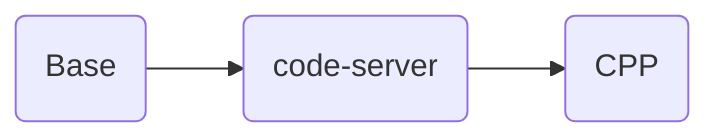

# coder-workspace-stacks
## 如果您通过github访问本项目，请注意
1. github上的仓库是由源仓库推送的镜像仓库，是一个镜像仓库
2. 我们的源仓库是 https://eoelab.org:1031/build-image-stacks/coder-workspace-stacks  
3. 我们的docker镜像仓库是 https://hub.docker.com/r/ben0i0d/coder   
4. 对于issue/PR，我们推荐在源仓库上提，这对于我们工作更方便，但是如果您在github上提，我们也会跟进处理  
## 项目梗概
### 用途
用于支撑我们在线IDE-coder的工作区构建项目
### 如何使用
#### Docker
镜像可以像docker容器一样使用，但是具体的使用方法要参考内部搭载的ide 
#### Coder
在template内指定镜像即可  
### 如何参与以及贡献指导
1. 项目内main分支Dockerfile是经过测试而发布的
2. 如果您有新的测试需求，在拥有权限的情况下请自行构建一个新的分支，注意修改新分支内的CI配置文件，并且在提交合并请求时还原CI配置
3. 本项目默认落地场景是我们的K8S集群（RKE2）
4. 如果您有更好的思路，可以在本项目中提出issue，PR  
5. 对于本地化工作，包括apt，conda，pip,npm配置中国境内镜像源，汉化等，不建议移除
### 参数说明，包括源和版本等
conda bfsu：https://mirrors.bfsu.edu.cn/help/anaconda/  
pip bfsu：https://mirrors.bfsu.edu.cn/help/pypi/  
apt ustc：https://mirrors.ustc.edu.cn/help/ubuntu.html  
npm npmmirror(AliYun): https://registry.npmmirror.com/  
apache tuna: https://mirrors.tuna.tsinghua.edu.cn/apache/
### 项目上游
本项目直接上游是Coder团队项目https://github.com/coder/enterprise-images  
但是我们与上游的差别较大，包括源，软件包，本地化与扩展等，因此如果您从本项目派生遇到问题，请不要到Coder团队提问，这会加大他们的工作量  
对于很多自定义化的镜像注意查看，或者在项目内提issue  
### 当前构建镜像清单
* base：基础镜像，包括基础的git bash curl wget nano vim sudo,并且配置信任我们本地自签名证书
* code-server：安装code-server（https://github.com/coder/code-server）,对于语言支持在三级目录下
## 镜像依赖关系

## 必要的授权说明
对于派生自coder团队的代码，我们添加了如下的版权声明，我们保留并且支持coder开发团队版权
```
# Copyright (c) 2020 Coder Technologies Inc.
```
对于可能来自其他团队的代码，我们还在进一步审查代码并添加版权标识
